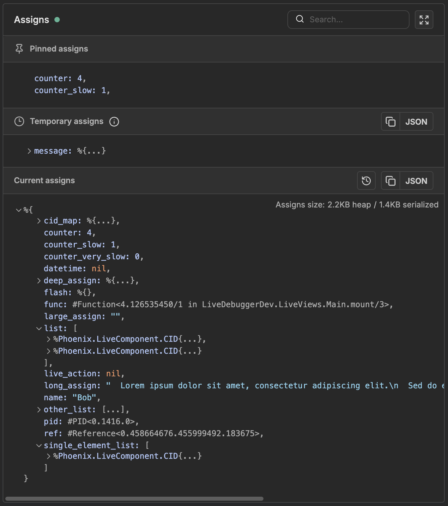
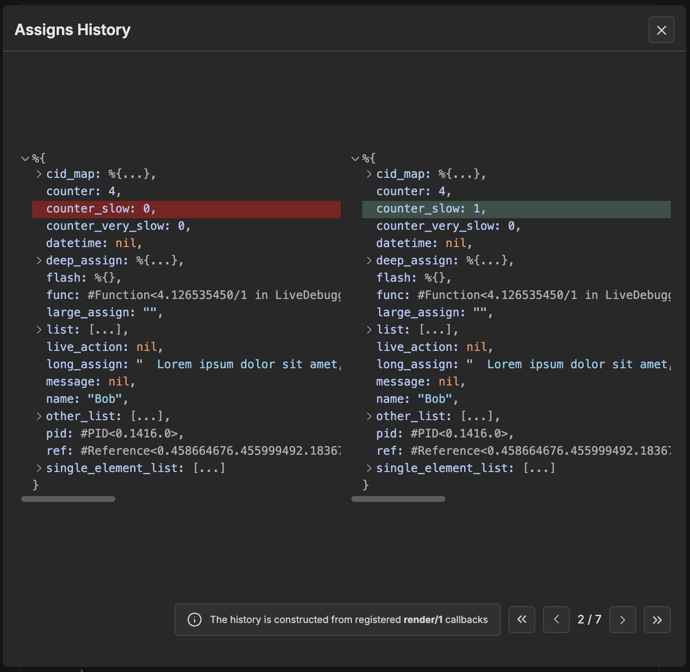

This feature helps you inspect current state of assigns of any `LiveView` or `LiveComponent` inside your debugged application. It is updated whenever assigns of currently inspected node (`LiveView` or `LiveComponent`) change.

## How to use

After triggering events callbacks in debugged `LiveView`, changes in its assigns are immediately shown. This is useful to see how user actions affect a component's state and confirm that assigns are updating as expected.

If examined assigns are too big they are collapsed at certain level for ease of use. You can expand them according to your needs.

If you want to dive deeper and for example perform some operations on particular assigns you can copy them from LiveDebugger and paste it inside your IEx session.

You can pin interesting assigns for quick access, copy selected assigns as JSON, browse temporary assigns, and check the size of assigns to quickly identify large state entries.

When working with bigger state trees, use the search bar to quickly locate a specific assign by name or value.

## Assigns history

Assigns history lets you inspect how assigns changed over time. For each update, you can view a diff to see exactly what was added, removed, or modified, which makes it much easier to understand state transitions across user interactions.

## How It Helps with Debugging

- Track state changes: Immediately see how user actions affect a component's state.
- Debug reactivity issues: Confirm that assigns are updating as expected.
- Spot bugs faster: Catch incorrect or missing updates to assigns without guesswork.
- Understand `LiveView` flow: Get deeper insight into the lifecycle and behavior of your components.

This feature is especially useful when debugging tricky UI state issues, like counters not updating, buttons staying disabled, or incorrect data appearing in forms.

You can think of it like a live `IO.inspect/1` with context, always up to date and right where you need it.
