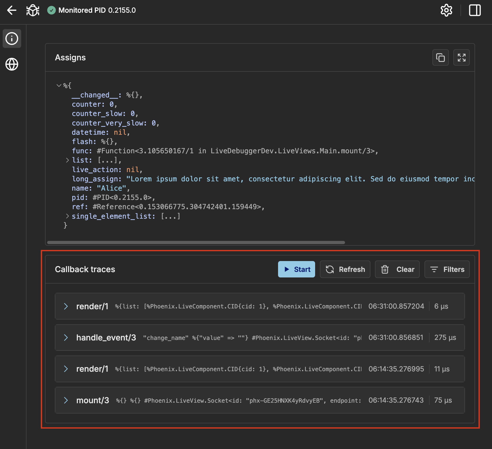
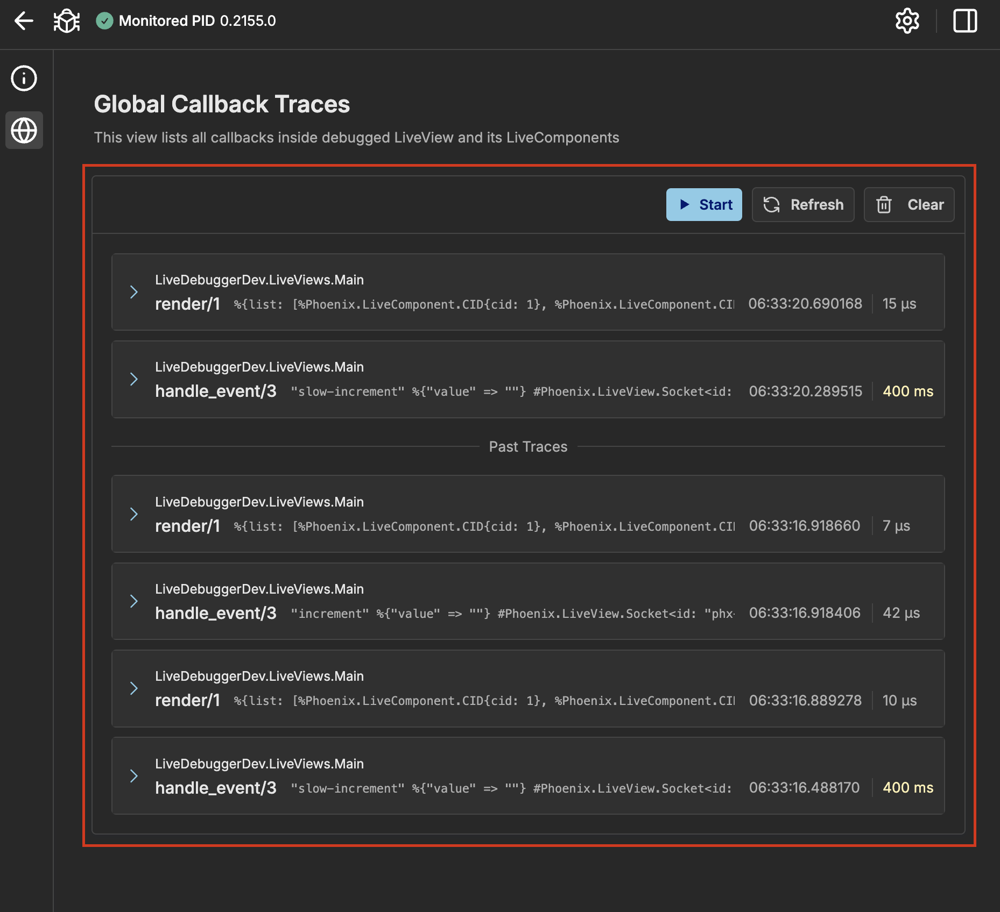
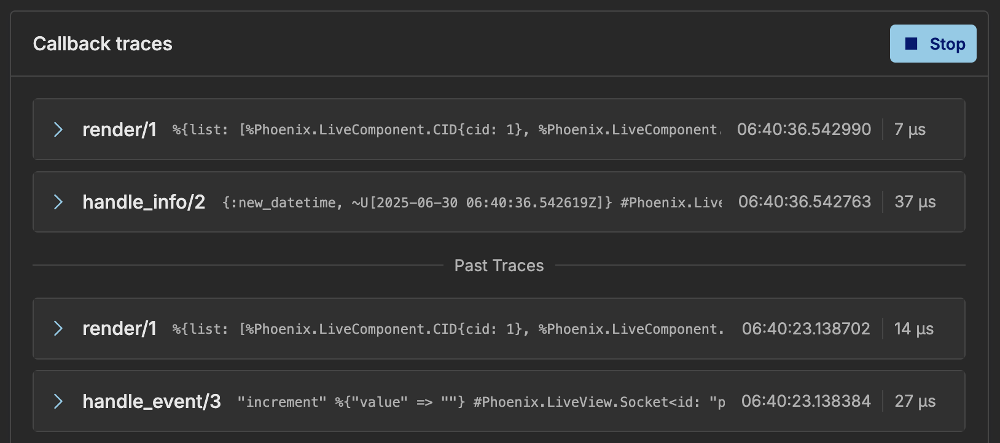
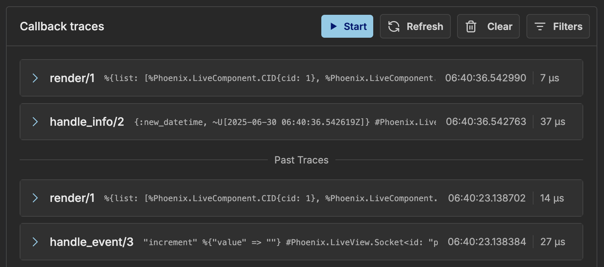
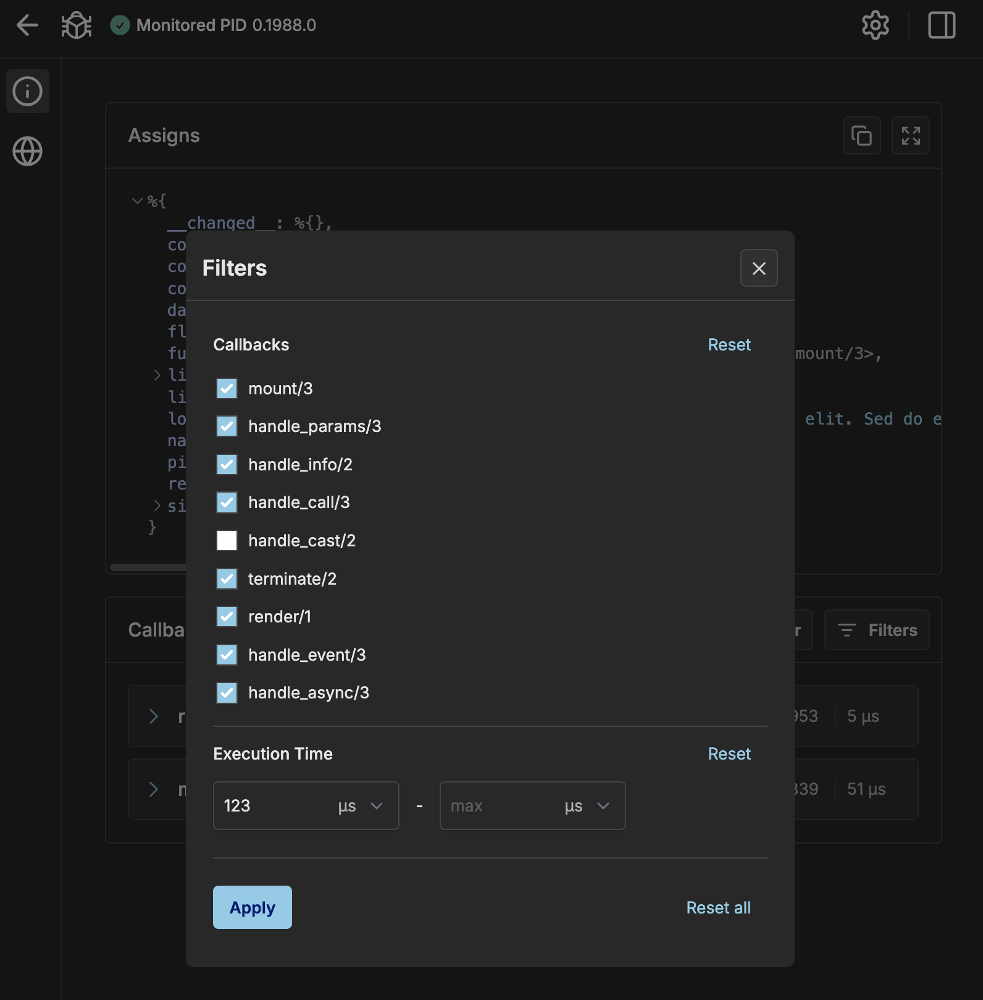
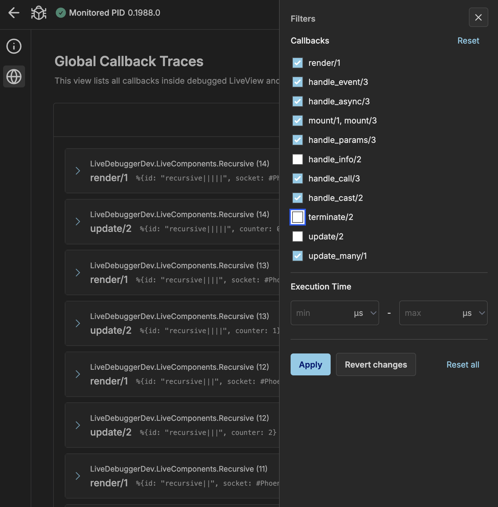
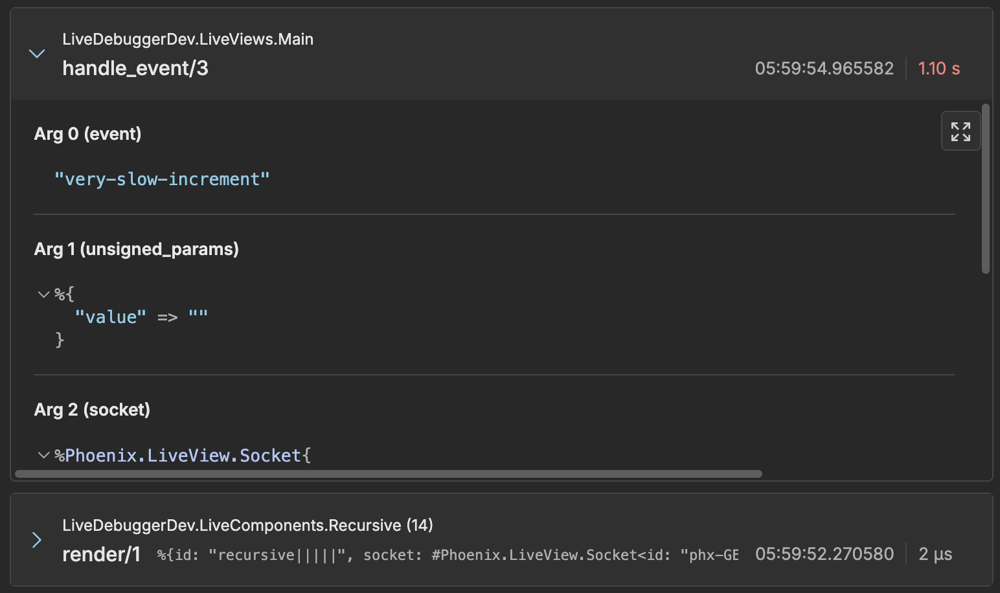
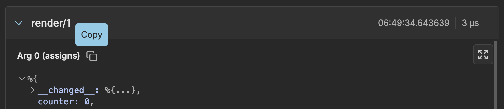
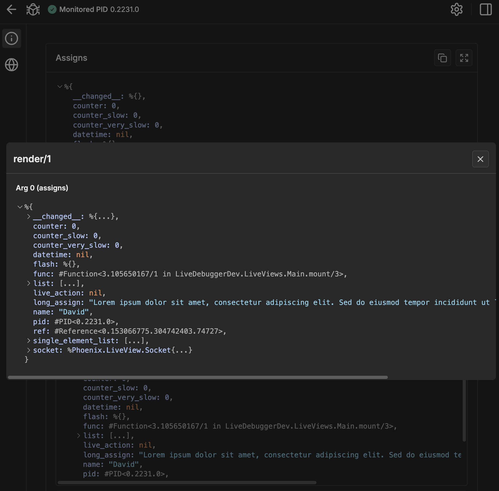

This is a complex feature which allows to see how functions in your Live View application are being called. It is main feature which helps with identifying many problems.

Callback tracing is done inside `Node Inspector` where you can see callbacks of selected node



or you can inspect all nodes inside `Global Traces`



Callback tracer can be in 2 states:

<!-- TODO: USE figs here -->

- **Started** - You see all traces live as you use your debugged application, you cannot use filters.



- **Stopped** - you need to refresh to see newest callbacks, you can use filters



By default it will be stopped when you change nodes or navigate to other Live View.

### Buttons

- _Start_ - starts active tracing
- _Refresh_ - loads traces
- _Clear_ - removes traces (also the ones stored in memory)
- _Filters_ - opens filters modal (only in `Node Inspector`)

### Filters

Filters are used for both started tracing and refreshing. In `Node Inspector` they can be accessed via button and are displayed in modal. You can reset each section or all of them. If you close modal without clicking `Apply` nothing will change.



When using `Global Traces` filters will be shown on the right (or in sidebar on small screens). To discard filters change you can click _Revert changes_ button.



To better improve locating specific information you can filter by:

- **Callbacks** - When working in `Node Inspector` you will see either `LiveView` or `LiveComponent` callback names. In `Global Traces` there will be all available callbacks to filter. It is useful when some you want to check specific part of your application (typically `handle_event`).
- **Execution Time** - It is useful for checking bottlenecks in your app. You can set both minimal and maximal value (with unit).

### Trace information



Traces contain useful information:

- Callback name with arity
- Short preview of arguments (for easier differentiating)
- Timestamp of callback execution start
- Time of execution (_yellow_ for slow and _red_ for very slow)

Also in `Global Traces` you have module name (when `LiveComponent` then with `CID`) which will redirect you to `Node Inspector` with proper node selected.

When you expand a trace you will see detailed list of arguments.

You can copy each one of them if you want to process them in terminal.



You are also able to see them in fullscreen mode.



### Configuration

When your application works in multiple nodes Callback Tracing might not work properly. Please add delay to setup for proper working

```elixir
config :live_debugger, :tracing_setup_delay, 200 # in ms
```

Live Debugger is using garbage collection of traces in order to not take too much space in memory. If you want to change the size of data which is kept in memory please change ETS table max size. Currently each table is for each debugged LiveView process so keep it in mind.

```elixir
 config :live_debugger, :approx_table_max_size, 20 # in MB
```

We are approximating size of elixir terms in garbage collection so the actual maximum value can be higher.
