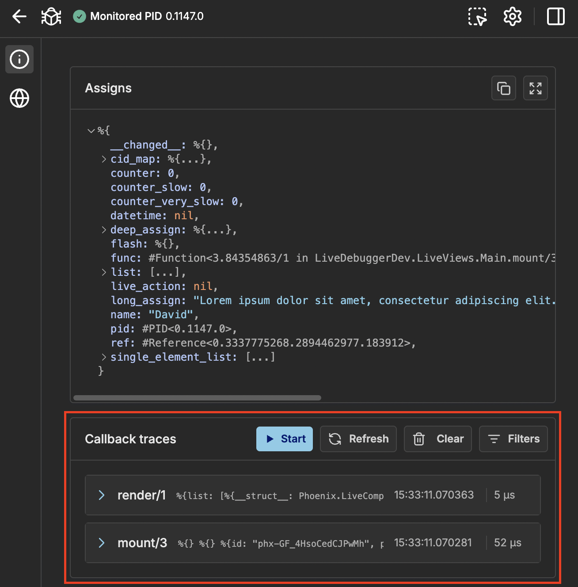
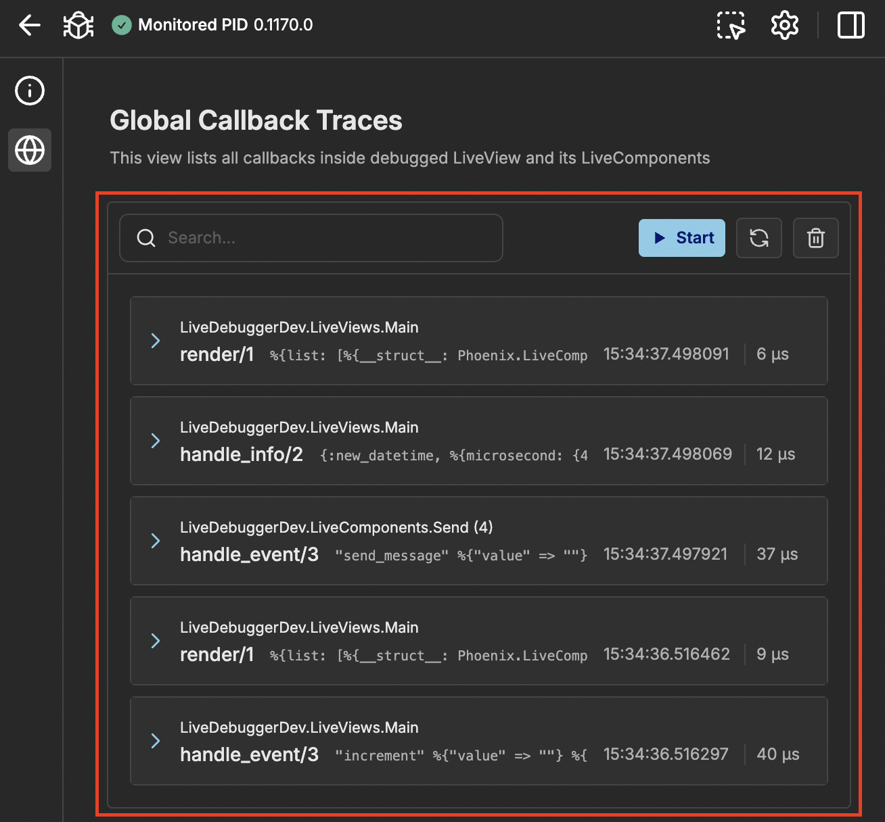

This is a complex feature which allows to see how functions in your LiveView application are being called.

Callback tracing is done inside `Node Inspector` where you can see callbacks of selected node



or you can inspect all nodes inside `Global Traces`



Callback tracer can be in 2 states:

- **Started** - You see all traces live as you use your debugged application, you cannot use filters.
- **Stopped** - you need to refresh to see newest callbacks, you can use filters

By default it will be stopped when you change nodes or navigate to other LiveView.

## How to use

### Buttons

- _Start_ - starts active tracing
- _Refresh_ - loads newest traces
- _Clear_ - removes traces (also the ones stored in memory)

### Filters

Filters are used for both started tracing and refreshing. In `Node Inspector` they can be accessed via button and are displayed in modal. You can reset each section or all of them. If you close modal without clicking `Apply` nothing will change.

When using `Global Traces` filters will be shown on the right (or in sidebar on small screens). To discard filters change you can click _Revert changes_ button.

To better improve locating specific information you can filter by:

- **Callbacks** - When working in `Node Inspector` you will see **either** `LiveView` or `LiveComponent` callback names. In `Global Traces` there will be all available callbacks to filter. It is useful when some you want to check specific part of your application (typically `handle_event`).
- **Execution Time** - It is useful for checking bottlenecks in your app. You can set both minimal and maximal value (with unit).

### Search and highlight

Search is a special filter available only for `GLobal Traces`. It allows to query trace's arguments to filter traces and highlight searched phrase. It will highlight all occurrences inside callback arguments and expand structs to see all of them.

### Trace information

Traces contain useful information:

- Callback name with arity
- Short preview of arguments (for easier differentiating)
- Timestamp of callback execution start
- Time of execution (_yellow_ for slow and _red_ for very slow)

Also in `Global Traces` you have module name (when `LiveComponent` then with `CID`) which will redirect you to `Node Inspector` with proper node selected.

When you expand a trace you will see detailed list of arguments.

You can copy each one of them if you want to process them in terminal.


You are also able to see them in fullscreen mode.


### Traced callbacks

LiveDebugger traces callbacks of `Phoenix.LiveView` and `Phoenix.LiveComponent` behaviours in your application.

#### LiveView

- `handle_async/3`
- `handle_call/3`
- `handle_cast/2`
- `handle_event/3`
- `handle_info/2`
- `handle_params/3`
- `mount/3`
- `render/1`
- `terminate/2`

#### LiveComponent

- `handle_async/3`
- `handle_event/3`
- `mount/1`
- `render/1`
- `update/2`
- `update_many/1`

## Configuration

When you have complex application and Callback Tracing doesn't work after starting up then add delay of LiveDebugger setup:

```elixir
config :live_debugger, :tracing_setup_delay, 200 # in ms
```

## How Callback Tracing works

To properly check each callback we are leveraging erlang's [`:dbg`](https://www.erlang.org/doc/apps/runtime_tools/dbg.html) module. When the application starts `:dbg.tracer/0` is initiated and calls for all LiveView or LiveComponent modules are added. It traces start of the callback, end of it and exceptions if some occur which allows to measure time of execution and which callback ended with error.

If you are using code reloading tracing may stop working due to modules being recompiled. To fix this issue see `Settings` and either select automatic tracing refresh or do it manually.

> ### Warning {: .warning}
>
> Automatic tracing refresh may have negative impact on your app performance
