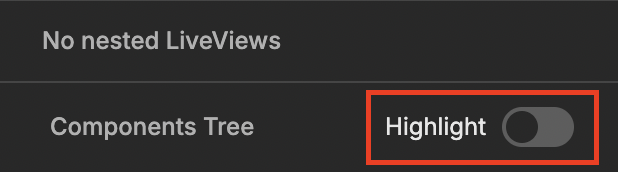

This feature helps you visually identify and locate components rendered in the current debugged LiveView. This makes it easier to understand the structure of the page and debug rendering issues effectively.

> #### Important {: .info}
>
> Components Highlighting works only when browser features are enabled.
>
> They are enabled by default but you can enable them explicitly.
>
> ```elixir
> # config/dev.exs
>
> # Enables all browser features and inject LiveDebugger JS
> config :live_debugger, :browser_features?, true
> ```
>
> You can also disable components highlighting keeping other browser features enabled.
>
> ```elixir
> # config/dev.exs
>
> config :live_debugger, :highlighting?, false
> ```

## How to use

You turn highlighting mode on by clicking switch button on top of LiveComponents tree.



When highlighting mode is enabled you can hover over the name of given LiveComponent and LiveDebugger will highlight corresponding DOM element in your debugged LiveView. This mode provides immediate, non-intrusive feedback about where the component is rendered.

### How It Helps with Debugging

- Accelerate navigation: Save time locating components in complex LiveView UIs.
- Distinguish LiveComponents that are rendered multiple times.

> #### Important {: .info}
>
> This feature is disabled when LiveDebugger is in DeadViewMode (when the debugged process dies).
