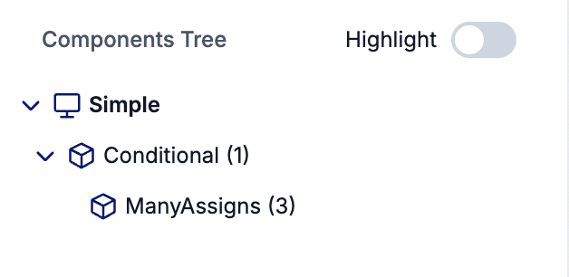

This feature helps you examine how LiveComponents are arranged ind your debugged LiveView. It identifies the structure based on state of LiveView processes so it is able to detect change of this state as in [conditional LiveComponents](#conditional-livecomponents).

The root of the tree is `LiveView` and children are `LiveComponents`.

It also is used for navigation between nodes (LiveView or LiveComponent) done inside Node Inspector.

### Conditional LiveComponents

It updates status when conditional LiveComponents are added and deleted as well as see their CID (identifier for components in single LiveView)

### Nested LiveViews

Nested LiveViews are not shown inside components tree. They are separate processes which you can debug. In sidebar you can see list of LiveViews which are children to currently debugged one.

> #### Important {: .info}
>
> All Nested LiveViews don't shows a flatten structure, which means that not all of them are direct children.

If you are debugging nested LiveView you can return to parent by `Parent LiveView Process` link shown in Sidebar.
