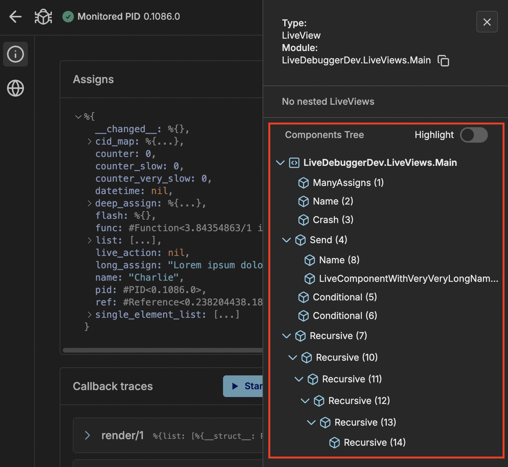

This feature helps you examine how LiveComponents are arranged in your debugged LiveView. It identifies the structure based on state of LiveView processes. LiveDebugger listens on state changes and refreshes your Components Tree.

The root of the tree is LiveView and children are LiveComponents with their CIDs (`Phoenix.LiveComponent.CID`). When there are many elements, the tree will be collapsed appropriately.

It can be also used for:

- Navigation inside Node Inspector
- [`Components Highlighting`](components_highlighting.md)

### Conditional LiveComponents

Components Tree helps you discover adding and removing of conditionally rendered LiveComponents.

### Nested LiveViews

Nested LiveViews are not shown inside Components Tree since they are separate processes which you can debug. In sidebar you can see list of LiveViews which are children to currently debugged one.

> #### Important {: .info}
>
> All Nested LiveViews are displayed in a flatten structure, which means that not all of them are direct children of currently debugged LiveView.

If you are debugging nested LiveView you can return to parent by _Parent LiveView Process_ link shown in Sidebar.
