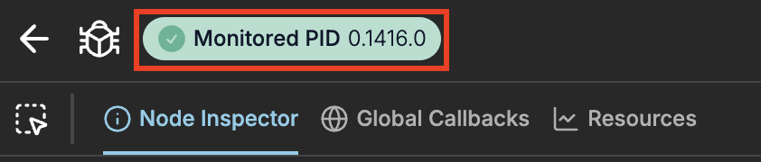
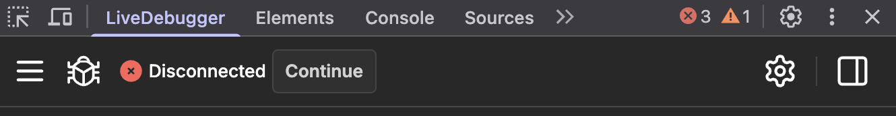
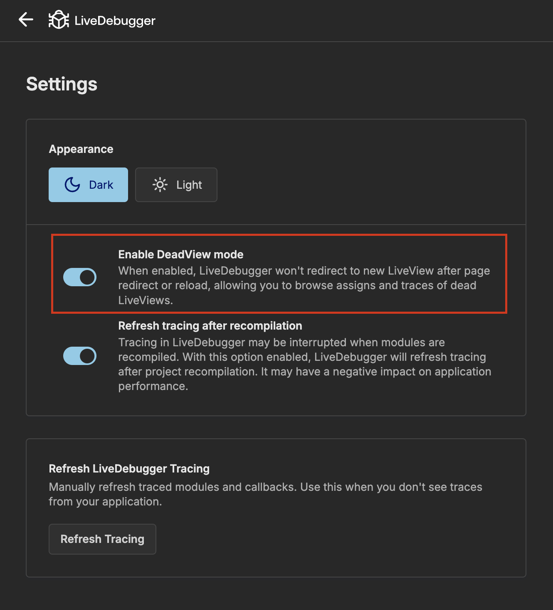

This feature allows you to debug the state of your application after redirecting or encountering a crash.

> #### Limitations {: .info}
>
> Inspecting "dead" LiveView process is temporary. If you refresh your debugger or navigate to `Active LiveViews` or `Settings` then the information will be lost.

DeadView Mode allows you to freely use both `Node Inspector` and `Global Traces`. The state, and callbacks are stored until you will continue to the next LiveView.

## How to use

### Status indicator

On your navbar you can see the status of monitored LiveView.

When LiveView is _alive_ you can see it's `PID`.



When LiveView is _dead_ you can click `Continue` to find a successor (page which you've navigated to or the reconnected page after crash).



### How it helps with Debugging

When dealing with either crash or redirection you can:

- Inspect last state of LiveView or LiveComponents
- See callbacks order and which one was the last

## Configuration

You can enable or disable DeadView Mode either in config file or in settings. By default it will be enabled.

```elixir
config :live_debugger, :dead_view_mode, true
```


