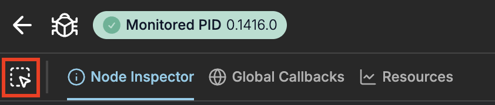

This feature helps you inspect LiveViews and LiveComponents directly from the rendered page.
You can open LiveDebugger `Node Inspector` on right element by selecting it with mouse on the page.

> #### Important {: .info}
>
> Elements Inspection works only when browser features are enabled.
>
> They are enabled by default but you can enable them explicitly:
>
> ```elixir
> # config/dev.exs
>
> # Enables all browser features and inject LiveDebugger JS
> config :live_debugger, :browser_features?, true
> ```
>
> For proper working make sure you don't have highlighting disabled.
>
> It's enabled by default but you can enable it explicitly:
>
> ```elixir
> # config/dev.exs
>
> config :live_debugger, :highlighting?, true
> ```

### How to use

You can enable inspecting mode in two ways:

- Using `Debug Button` in the debugged LiveView window (clicking button and selecting from menu)

- Using `Inspect Element` button in the LiveDebugger (not available in `Dead View Mode`)



When enabled you can hover elements on the page and see them highlighted and short information about the given element.

- When using `Debug Button` clicking on element will open `Node Inspector` for that element in a new browser tab.
- When using `Inspect Element` button you can click on element to open `Node Inspector` in the same LiveDebugger tab or devtools extension.
