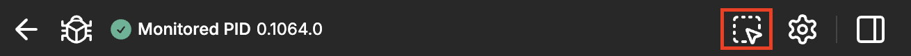

This feature helps you inspect LiveViews and LiveComponents directly from the rendered page. 
You can open LiveDebugger `Node Inspector` on right element by selecting it with mouse on the rendered page.

### How to use
You can enable inspecting mode in two ways:
- Using `Debug Button` in the debugged LiveView window (clicking button and selecting from menu).

  

- Using `Inspect Element` button in the LiveDebugger.

  

When enabled you can hover elements on the page and see them highlighted and short information about the given element. 
- When using `Debug Button` clicking on element will open `Node Inspector` for that element in a new browser tab.
- When using `Inspect Element` button you can click on element to open `Node Inspector` in the same LiveDebugger tab or devtools extension.
