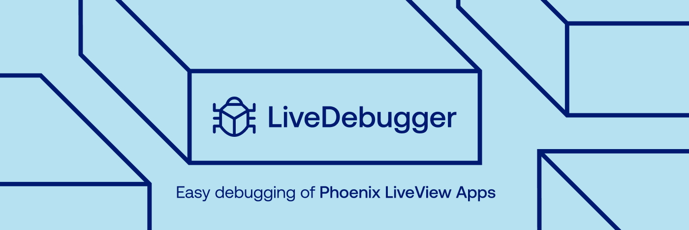

LiveDebugger is a browser-based tool for debugging applications written in [Phoenix LiveView](https://github.com/phoenixframework/phoenix_live_view) - an Elixir library designed for building rich, interactive online experiences with server-rendered HTML.

Designed to enhance your development experience LiveDebugger gives you:

- A detailed view of your LiveComponents tree
- The ability to inspect assigns for LiveViews and LiveComponents
- Tracing of their callback executions
- Components highlighting

## Installation

> #### Important {: .info}
>
> LiveDebugger should not be used on production - make sure that the dependency you've added is `:dev` only

<!-- tabs-open -->

### Mix installation

Add `live_debugger` to your list of dependencies in `mix.exs`:

```elixir
  defp deps do
    [
      {:live_debugger, "~> 0.2.0", only: :dev}
    ]
  end
```

For full experience we recommend adding below line to your application root layout. It attaches `meta` tag and LiveDebugger scripts in dev environment enabling browser features.

```elixir
  # lib/my_app_web/components/layouts/root.html.heex

  <head>
    <%= Application.get_env(:live_debugger, :live_debugger_tags) %>
  </head>
```

After you start your application, LiveDebugger will be running at a default port `http://localhost:4007`.

### Igniter installation

LiveDebugger has [Igniter](https://github.com/ash-project/igniter) support - an alternative for standard mix installation. It'll automatically add LiveDebugger dependency and modify your `root.html.heex` after you use the below command.

```bash
mix igniter.install live_debugger
```

<!-- tabs-close -->

### DevTools extension

Since version v0.2.0 you can install official LiveDebugger DevTools extension, giving you the ability to interact with its features alongside your application's runtime.

- [Chrome extension](https://chromewebstore.google.com/detail/gmdfnfcigbfkmghbjeelmbkbiglbmbpe?utm_source=item-share-cb)
- Firefox extension - coming soon!

> #### Note {: .info}
>
> Ensure the main LiveDebugger dependency is added to your mix project, as the browser plugin alone is not enough.

## Authors

LiveDebugger is created by Software Mansion.

Since 2012 [Software Mansion](https://swmansion.com/?utm_source=git&utm_medium=readme&utm_campaign=livedebugger) is a software agency with experience in building web and mobile apps as well as complex multimedia solutions. We are Core React Native Contributors, Elixir ecosystem experts, and live streaming and broadcasting technologies specialists. We can help you build your next dream product – [Hire us](https://swmansion.com/contact/projects).

Copyright 2025, [Software Mansion](https://swmansion.com/?utm_source=git&utm_medium=readme&utm_campaign=livedebugger)

[](https://swmansion.com/?utm_source=git&utm_medium=readme&utm_campaign=livedebugger)

Licensed under the [Apache License, Version 2.0](https://github.com/software-mansion/live-debugger/blob/main/LICENSE)
